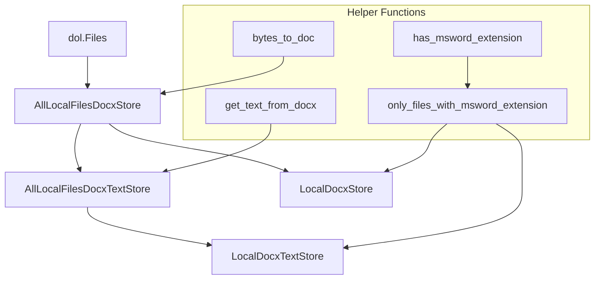
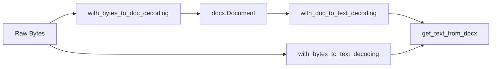

# msword: local files Manager(s)

Simple mapping view to docx (Word Doc) elements

To install:	```pip install msword```


- [Installation](#installation)
- [Quick Start](#quick-start)
- [LocalDocxTextStore](#localdocxtextstore)
- [LocalDocxStore](#localdocxstore)
- [Package Architecture](#package-architecture)
  - [Main Classes](#main-classes)
  - [Helper Functions](#helper-functions)
  - [Mapping Wrappers](#mapping-wrappers)
- [Mermaid Graphs](#mermaid-graphs)
- [License](#license)

---

## Quick Start

For users who just want to extract text from a collection of local MS Word documents, the simplest approach is to use the `LocalDocxTextStore`. The following example demonstrates how to create a text store from a folder containing MS Word files and access the text content of a document:

```python
from msword import LocalDocxTextStore
from msword.tests.util import test_data_dir  # Directory with test data

# Create a text store that extracts and returns text from MS Word documents.
docs_text_content = LocalDocxTextStore(test_data_dir)

# List the available document keys (filtered to valid MS Word files).
print(sorted(docs_text_content))

# Access the text of a specific document.
print(docs_text_content['simple.docx'])
```

For users needing the full `docx.Document` objects for more advanced processing (e.g., modifying document structure, styling, etc.), use the `LocalDocxStore`:

```python
from msword import LocalDocxStore
from msword.tests.util import test_data_dir
import docx

store = LocalDocxStore(test_data_dir)
doc = store['with_doc_extension.doc']
assert isinstance(doc, docx.document.Document)
print(doc.paragraphs[0].text)
```


## LocalDocxTextStore

Local files store returning, as values, text extracted from the documents.
Use this when you just want the text contents of the document.
If you want more, you'll need to user `LocalDocxStore` with the appropriate content extractor
(i.e. the obj_of_data function in a `dol.wrap_kvs` wrapper).

Note: Filters for valid msword extensions (.doc and .docx).
To NOT filter for valid extensions, use ``AllLocalFilesDocxTextStore`` instead.

```python
>>> from msword import LocalDocxTextStore, test_data_dir
>>> import docx
>>> s = LocalDocxTextStore(test_data_dir)
>>> assert {'with_doc_extension.doc', 'simple.docx'}.issubset(s)
>>> v = s['simple.docx']
>>> assert isinstance(v, str)
>>> print(v)
Just a bit of text to show that is works. Another sentence.
This is after a newline.
<BLANKLINE>
This is after two newlines.
```

## LocalDocxStore

Local files store returning, as values, docx objects.
Note: Filters for valid msword extensions (.doc and .docx).
To Note filter for valid extensions, use ``AllLocalFilesDocxStore`` instead.

```python
>>> from msword import LocalDocxStore, test_data_dir
>>> import docx
>>> s = LocalDocxStore(test_data_dir)
>>> assert {'with_doc_extension.doc', 'simple.docx'}.issubset(s)
>>> v = s['with_doc_extension.doc']
>>> assert isinstance(v, docx.document.Document)
```

What does a ``docx.document.Document`` have to offer?
If you really want to get into it, see here: https://python-docx.readthedocs.io/en/latest/

Meanwhile, we'll give a few examples here as an amuse-bouche.

```python
>>> ddir = lambda x: set([xx for xx in dir(x) if not xx.startswith('_')])  # to see what an object has
>>> assert ddir(v).issuperset({
...     'add_heading', 'add_page_break', 'add_paragraph', 'add_picture', 'add_section', 'add_table',
...     'core_properties', 'element', 'inline_shapes', 'paragraphs', 'part',
...     'save', 'sections', 'settings', 'styles', 'tables'
... })
```

``paragraphs`` is where the main content is, so let's have a look at what it has.

```python
>>> len(v.paragraphs)
21
>>> paragraph = v.paragraphs[0]
>>> assert ddir(paragraph).issuperset({
...     'add_run', 'alignment', 'clear', 'insert_paragraph_before',
...     'paragraph_format', 'part', 'runs', 'style', 'text'
... })
>>> paragraph.text
'Section 1'
>>> assert ddir(paragraph.style).issuperset({
...     'base_style', 'builtin', 'delete', 'element', 'font', 'hidden', 'locked', 'name', 'next_paragraph_style',
...     'paragraph_format', 'part', 'priority', 'quick_style', 'style_id', 'type', 'unhide_when_used'
... })
>>> paragraph.style.style_id
'Heading1'
>>> paragraph.style.font.color.rgb
RGBColor(0x2f, 0x54, 0x96)
```

You get the point...

If you're only interested in one particular aspect of the documents, you should your favorite
`dol` wrappers to get the store you really want. For example:

```python
>>> from dol import wrap_kvs
>>> ss = wrap_kvs(s, obj_of_data=lambda doc: [paragraph.style.style_id for paragraph in doc.paragraphs])
>>> assert ss['with_doc_extension.doc'] == [
...     'Heading1', 'Normal', 'Normal', 'Heading2', 'Normal', 'Normal',
...     'Heading1', 'Normal', 'Normal', 'Normal', 'Normal', 'Normal', 'Normal', 'Normal',
...     'ListParagraph', 'ListParagraph', 'Normal', 'Normal', 'ListParagraph', 'ListParagraph', 'Normal'
... ]
```

The most common use case is probably getting text, not styles, out of a document.
It's so common, that we've done the wrapping for you:
Just use the already wrapped LocalDocxTextStore store for that purpose.


---

## Package Architecture

The module is built around a set of core classes and helper functions. Its functionality is entirely defined by the combination of a base file store (from `dol.Files`) and a set of decorators that wrap the store to transform its values.

### Main Classes

- **AllLocalFilesDocxStore**  
  A wrapper around a local file store that returns file contents as `docx.Document` objects. This class does not filter file extensions, meaning that non-MS Word files might cause errors.

- **AllLocalFilesDocxTextStore**  
  Inherits from `AllLocalFilesDocxStore` and applies a text extraction function (`get_text_from_docx`). It returns the concatenated text of all paragraphs in the document.

- **LocalDocxStore**  
  Extends `AllLocalFilesDocxStore` and uses the `only_files_with_msword_extension` decorator to filter out files that do not have valid MS Word extensions (i.e., `.doc` or `.docx`).

- **LocalDocxTextStore**  
  Extends `AllLocalFilesDocxTextStore` and applies the same file filtering as `LocalDocxStore`, ensuring that only valid MS Word files are processed.

### Helper Functions

- **_extension(k: str)**  
  Splits a filename and returns its extension.

- **has_msword_extension(k: str)**  
  Checks if a filename has a valid MS Word extension (`doc` or `docx`).

- **_remove_docx_extension(k: str) & _add_docx_extension(k: str)**  
  Utilities to remove or add the default `.docx` extension to keys.

- **paragraphs_text(doc)**  
  Yields the text from each paragraph of a `docx.Document`.

- **get_text_from_docx(doc, paragraph_sep='\n')**  
  Concatenates all paragraph texts from a document using the specified separator.

- **bytes_to_doc(doc_bytes: bytes)**  
  Converts raw bytes into a `docx.Document` using an in-memory buffer.

### Mapping Wrappers

- **with_bytes_to_doc_decoding**  
  Wraps a mapping to convert byte values into `docx.Document` objects.

- **with_doc_to_text_decoding**  
  Wraps a mapping to convert `docx.Document` objects into text.

- **with_bytes_to_text_decoding**  
  Combines the two above by first converting bytes into a document and then extracting its text.

- **only_files_with_msword_extension**  
  Filters the keys of a store so that only those with valid MS Word extensions are processed.

---

## Mermaid Graphs

### Overall Object Relationships



### Mapping Wrappers Pipeline



---

## License

This module is distributed under the terms of the MIT license.

